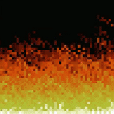

# Doom Fire with JavaScript

Este repositório foi inspirado no vídeo do Filipe Deschamps: <a href="https://youtu.be/fxm8cadCqbs?si=BhhhxZ7ZUTG4AP4v">Tutorial completo de como programar o Fogo do DOOM (JavaScript puro)</a>.

Te convido a acessar o artigo no Medium explicando o passo-a-passo da criação do código: <a href="https://medium.com/@willywonkabr/ca6d76db572c">Doom fire algorithm with JavaScript</a>.

Repositório do Filipe Deschamps: <a href="https://github.com/filipedeschamps/doom-fire-algorithm">doom-fire-algorithm</a>
